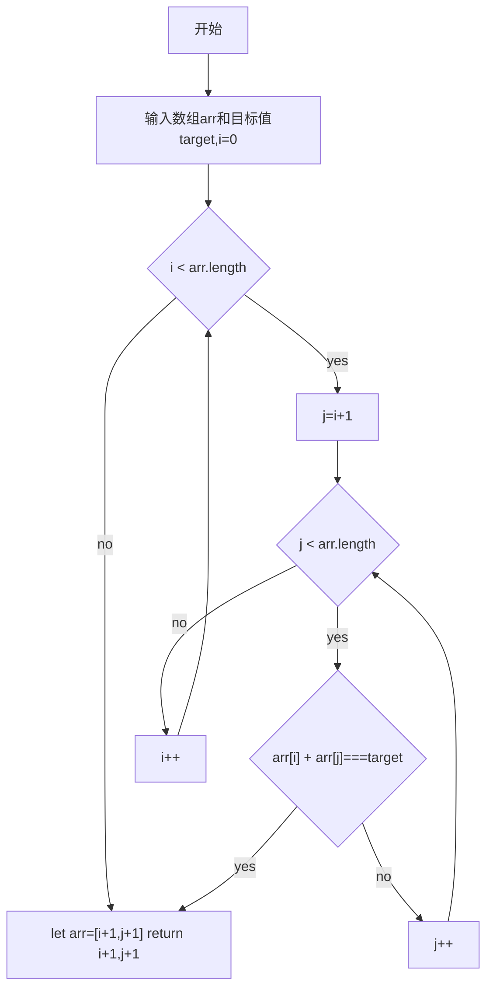
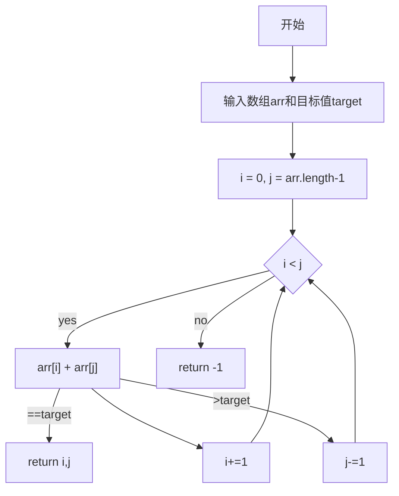

::: tip 参考资料：
[Two Pointer Approach - CP TacTics | Two Sum Problem | The Code Mate](https://www.youtube.com/watch?v=ymKrGndnTis) 
:::
## 双指针的应用场面
通常用在有序的数组和链表结构上
1. 相反方向的对撞指针：头尾开始，中间相遇，两数之和
2. 相同方向的快慢指针：从头或者尾开始，两个指针有属于自己的速度
   
## 双指针的关键
- 两个指针的定义
- 指针初始化
- 指针改变的条件和方向

## 使用双指针的好处
用暴力破解时，内外循环下，时间复杂度为O(n^2)；用双指针，不仅时间复杂度降为O(N)，也不需要额外空间。
我们以[leetcode167](#167)为例，先来思考暴力破解的过程。

## 相关题目
### <h3 id="167">[167 前后指针](https://leetcode-cn.com/problems/two-sum-ii-input-array-is-sorted/)</h3>
> 给你一个下标从 1 开始的整数数组 numbers ，该数组已按 非递减顺序排列  ，请你从数组中找出满足相加之和等于目标数 target 的两个数。如果设这两个数分别是 numbers[index1] 和 numbers[index2] ，则 1 <= index1 < index2 <= numbers.length 。
以长度为 2 的整数数组 [index1, index2] 的形式返回这两个整数的下标 index1 和 index2。
你可以假设每个输入 只对应唯一的答案 ，而且你 不可以 重复使用相同的元素。
你所设计的解决方案必须只使用常量级的额外空间。

- 暴力破解:外循环追踪第一个元素，内循环追踪数组里剩下的元素，第一个元素与剩下元素一一组对相加，若两元素相加不等于目标值，则更新外循环，追踪第二个元素，计算第二个元素与剩下元素一一相加的值。重复以上过程，直至找到相加等于目标值的两元素。


```
/**
 * @param {number[]} numbers
 * @param {number} target
 * @return {number[]}
 */
var twoSum = function(numbers, target) {
    for(let i = 0;i<numbers.length;i++){
        for(let j = i+1;j<numbers.length;j++){
           if(numbers[i]+numbers[j]=== target){
              let arr = [i+1,j+1]
                return arr
            }
        }
    }
    
};
```

- 碰撞指针:前指针追踪头部元素x，后指针追踪尾部元素y，如果x+y==target，搜索完毕。
因为数组为有序数组，所以 x+y < target时,应继续向右移动前指针。
x+y>target，说明 x+ y以后 的元素都大于target，此时应保持x不变，后指针向左移动。



```
/**
 * @param {number[]} numbers
 * @param {number} target
 * @return {number[]}
 */
var twoSum = function(numbers, target) {
    let i = 0,j=numbers.length -1;
    while(i<j){
        if(numbers[i] + numbers[j] === target){
            break
        }else if(numbers[i]+numbers[j]>target){
            j-=1
        }else{
            i+=1
        }
    }
    
    let arr = [i+1,j+1]
    return arr
};
```